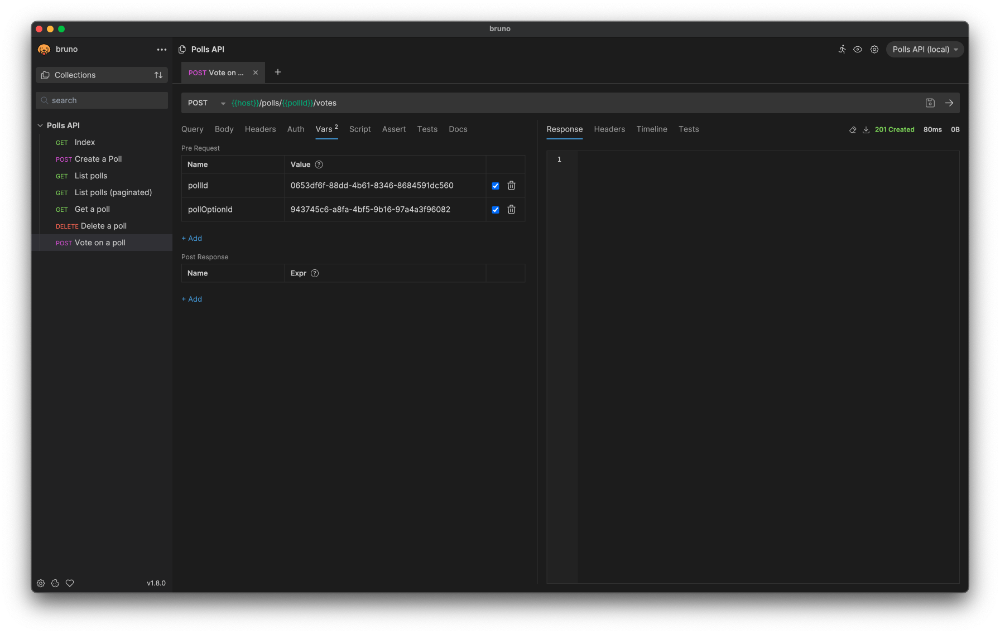
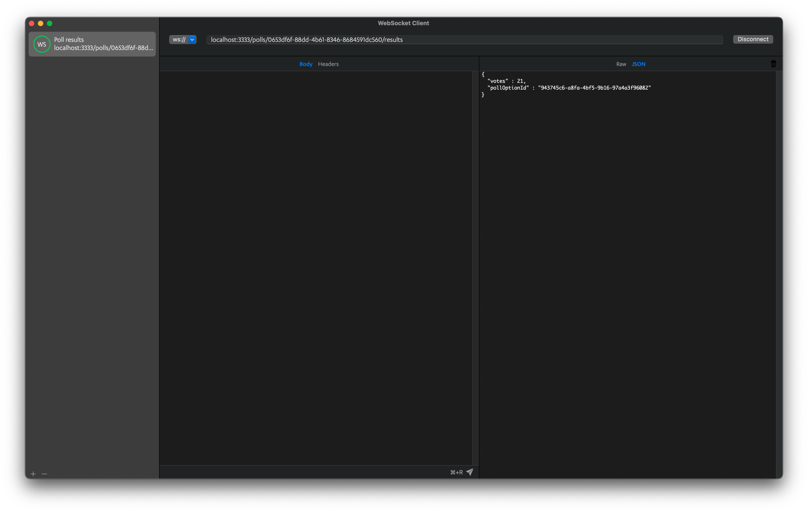

# Poll API

> Project desenvolvido durante o evento NLW Expert (Trilha Node.js) da Rocketseat.

## Pré-visualização

| HTTP | WS |
| - | - |
|  |  |

## Material complementar

- [NLW 14: Expert](https://efficient-sloth-d85.notion.site/NLW-14-Expert-9e11ff472de64b08a5f9e277a20c3ecc)
- [Node Target Mapping](https://github.com/microsoft/TypeScript/wiki/Node-Target-Mapping)

### Bibliotecas utilizadas

- [tsx](https://www.npmjs.com/package/tsx)
- [Prisma ORM](https://www.prisma.io/orm)
- [dotenv](https://www.npmjs.com/package/dotenv)
- [zod](https://www.npmjs.com/package/zod)
- [@fastify/cookie](https://www.npmjs.com/package/@fastify/cookie)
- [@fastify/websocket](https://www.npmjs.com/package/@fastify/websocket)
- [@fastify/cors](https://www.npmjs.com/package/@fastify/cors)

### Serviços utilizados

- [Neon](https://neon.tech/)
- [Upstash](https://upstash.com/)
